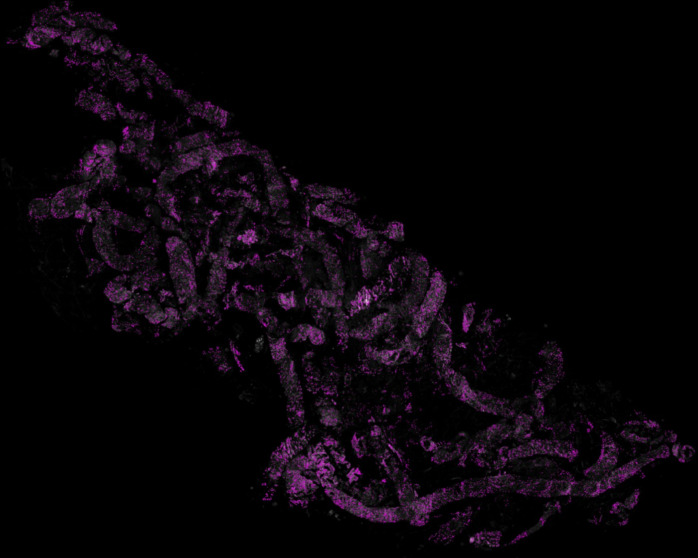
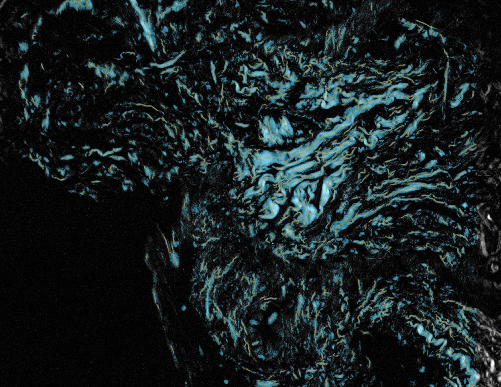
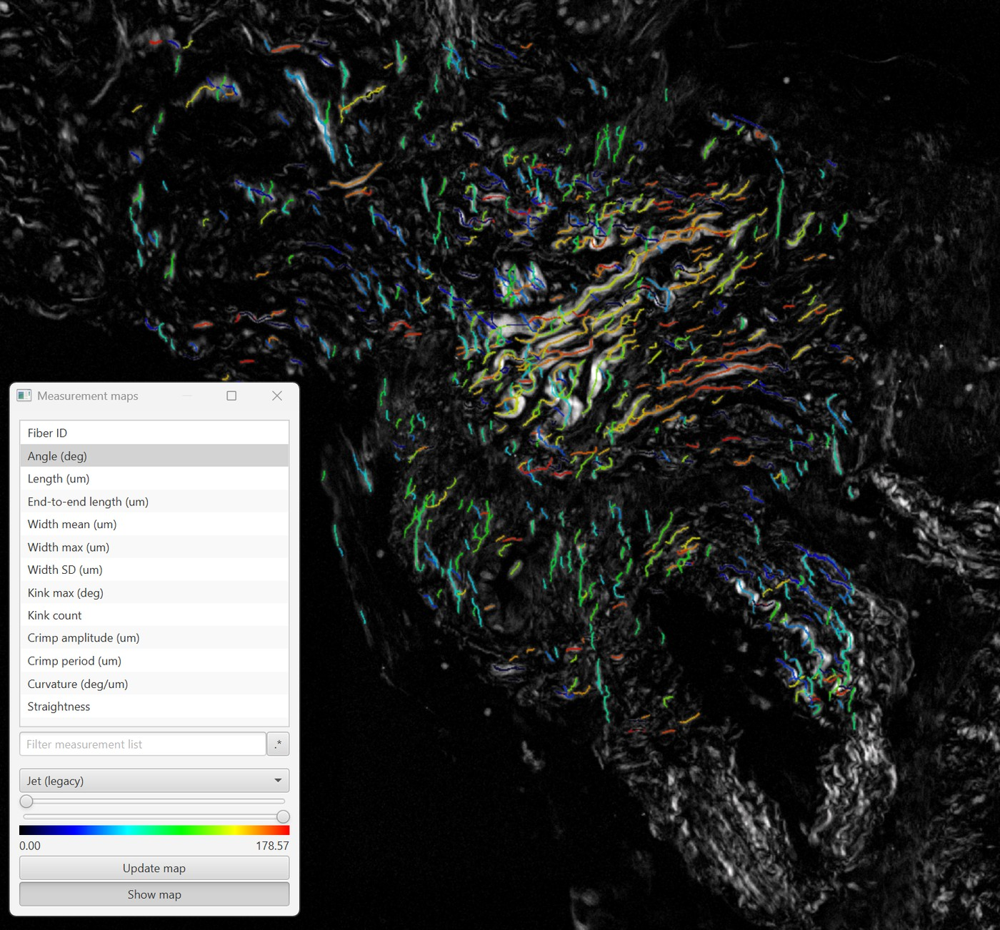

# qupath-extension-TME-Quant

A [QuPath](https://qupath.github.io) extension for **collagen fiber analysis**. It sends a
selected image region to the **TMEQuant FIRE** fiber-extraction pipeline over a local socket,
previews the detected fibers interactively, and adds them back to the image as annotations or
detections — optionally classified by **TACS** (Tumour-Associated Collagen Signatures) relative
to a tumour boundary.

The fiber math runs in a small **Python server** (the *FIRE backend*, built on CT-FIRE). This
extension is the QuPath-side client + UI; it does **not** bundle the backend (see
[Architecture](#architecture) and [Acknowledgements](#acknowledgements-and-citations)).

- 📖 **Settings reference:** [docs/COLLAGEN_SETTINGS.md](docs/COLLAGEN_SETTINGS.md) — every
  control, what it does, units, defaults, and tuning recipes.
- 🛠️ **Developer parameter detail:** [docs/PARAMETERS.md](docs/PARAMETERS.md).

> **New here?** Start with **You can't test it today** just below. The fuller, step-by-step instructions
> are in the collapsible sections under it (click a heading's ▸ to expand), and the complete
> walkthrough — including the manual fallback for every step — is in
> [server/WINDOWS_SETUP_GUIDE.md](server/WINDOWS_SETUP_GUIDE.md).

---

## What it looks like

The example below is collagen imaged by polarized-light birefringence, analyzed across a whole
slide. Each fiber becomes a QuPath object carrying its own measurements, so everything
downstream — filtering, classification, export, measurement maps — behaves like any other
QuPath detection.



*A whole slide after a full run. Magenta shows the traced fibers. The run is tiled
automatically, and fibers crossing a tile seam are stitched back together.*

| Detection on one tile | The same fibers, color-coded |
|---|---|
|  |  |
| **Cyan** is the threshold mask — the collagen FIRE is allowed to trace. **Orange** is the traced fiber centerline. Getting the cyan right is most of the work, which is why stage ① of the dialog previews it live. | The same region with QuPath's **Measurement maps** coloring each fiber by **angle**. Every per-fiber measurement is available this way — length, width, straightness, curvature, and the crimp/kink metrics. |

> 🔍 **Click either image to see the fibers.** They are fine lines and do not survive being
> shrunk to fit this page — the orange traces in particular all but vanish against the cyan mask.

---

## You can't test it today (Windows)

Not without step 2. The FIRE pipeline can't be redistributed from this repo, so you have to
request it from the maintainer before any of this will run. **Ask for it first**, then work
through the rest while you wait — the other pieces are a download and a double-click.

1. **From the [latest release](https://github.com/MichaelSNelson/qupath-extension-TME-Quant/releases/latest)**, download:
   - `qupath-extension-tme-quant-<version>-all.jar` (the extension), and
   - `tmequant-server-<version>.zip` (the server scripts).
2. **Get the FIRE pipeline** `TMEQuant_fire_only.zip` from the maintainer (it can't be
   redistributed here — see [Acknowledgements](#acknowledgements-and-citations)).
3. **Lay out a folder** (anywhere), e.g. `C:\CTFireTest`:
   - extract the server zip to `C:\CTFireTest\fiber_socket_bridge\`
   - extract the pipeline to `C:\CTFireTest\tme-quant\` (note the hyphen — it must sit *next to*
     `fiber_socket_bridge`).
4. **Double-click** `fiber_socket_bridge\tmequant_server.bat`. If MSYS2 isn't installed it
   **asks first** — `[I]`nstall to the default `C:\msys64`, `[M]` install it yourself to any
   drive (choose this if you can't write to `C:`), or `[Q]`uit. To use another drive with `[I]`,
   set `MSYS2_ROOT` first (e.g. `set "MSYS2_ROOT=D:\msys64"`) and re-run.
   > ⏱️ **The first run takes a while — this is normal.** It installs MSYS2 and downloads
   > **several hundred MB** of packages, then builds the FIRE engine: **expect ~5–15 minutes**
   > (longer on a slow network). It is **not** frozen — leave the window open until you see
   > `…listening on 127.0.0.1:5101 (backend=real)`. **Later runs start in seconds.**
5. **Drag the jar onto QuPath**, restart, then **Extensions ▸ TME Quant ▸ Analyze fibers…**.
   When prompted, point it at `tmequant_server.bat` once — after that QuPath starts the server
   for you.

That's it — open an image, draw a region, and preview. **Need more detail on any step?** Expand
the **Install** and **Use** sections below, or see the full
[Windows setup guide](server/WINDOWS_SETUP_GUIDE.md).

---

## What you need

<details>
<summary><b>Expand</b></summary>

1. **QuPath 0.7.x** (the extension targets 0.7.0).
2. **The extension jar** (this repo's release) — installed in QuPath.
3. **The FIRE server** — a Python environment that runs the fiber pipeline. On Windows this uses
   **MSYS2 UCRT64**; the included `server/tmequant_server.bat` automates the whole setup.
4. **The TMEQuant FIRE pipeline** (`tme-quant`) — obtained separately (it is **not** redistributed
   here; see [Acknowledgements](#acknowledgements-and-citations)). Place it next to the server
   scripts as described below.

</details>

---

## Install

<details>
<summary><b>Expand — full install steps</b></summary>

### 0. Get the three pieces first

| # | What | Where to get it |
|---|---|---|
| A | **Extension jar** (`qupath-extension-tme-quant-<version>-all.jar`) | [Releases](https://github.com/MichaelSNelson/qupath-extension-TME-Quant/releases/latest) |
| B | **Server scripts** (`tmequant-server-<version>.zip`) | [Releases](https://github.com/MichaelSNelson/qupath-extension-TME-Quant/releases/latest) (or the [`server/`](server/) folder of this repo) |
| C | **FIRE pipeline** (`tme-quant` / `TMEQuant_fire_only.zip`) | **Obtain from the maintainer** — it is *not* redistributed in this repo (the `tme-quant` package and the compiled CT-FIRE backend carry their own terms; see [Acknowledgements](#acknowledgements-and-citations)). Request it via this repo's [Issues](https://github.com/MichaelSNelson/qupath-extension-TME-Quant/issues) or your TMEQuant/LOCI contact. |

> Item **C** is the one external dependency you can't download from this repo. Get it before
> starting — the server won't run without it (the setup script checks for it and tells you if
> it's missing).

### 1. Install the extension in QuPath
Take the jar (**A**) and **drag it onto the QuPath window** (or copy it into your QuPath
*extensions* directory). Restart QuPath. You'll get an **Extensions ▸ TME Quant** menu.

### 2. Set up + start the FIRE server (Windows, one file)
Lay out a folder so the server scripts (**B**) and the pipeline (**C**) sit side by side:

```
CTFireTest\
  fiber_socket_bridge\   <- extract the server scripts zip (B) here
  tme-quant\             <- extract the FIRE pipeline (C) here
```

Then **double-click `fiber_socket_bridge\tmequant_server.bat`**. On first run it:

1. If **MSYS2** is missing it **asks before installing** — install to the default `C:\msys64`
   via `winget`, install it yourself to any drive (the MSYS2 installer lets you pick a folder),
   or quit. Set `MSYS2_ROOT` beforehand to target a different drive,
2. runs the one-time setup (system update + `setup_fire_server.sh`: dependencies, virtual env,
   and validates/builds the FIRE backend), guarded by a `.tmequant_setup_ok` marker, then
3. starts the server. You'll see `Fiber socket server listening on 127.0.0.1:5101 (backend=real)`.

> ⏱️ **First run downloads several hundred MB and builds the engine — budget ~5–15 minutes**
> (longer on a slow network). It isn't frozen; leave the window open. Later runs skip setup and
> start in seconds.

### 3. Let QuPath start the server for you
Open **Extensions ▸ TME Quant ▸ Analyze fibers in selected region…**. The first time, if the
server isn't running, QuPath offers to **locate the launcher** — point it at
`tmequant_server.bat`. From then on, opening the dialog **starts the server automatically** and
waits for it to be ready. You can change the launcher path any time via
**Extensions ▸ TME Quant ▸ Configure fiber server launcher…** or in QuPath
**Preferences ▸ TME Quant** (where you can also turn auto-launch off).

> Full step-by-step (including the manual fallback if a step fails):
> [server/WINDOWS_SETUP_GUIDE.md](server/WINDOWS_SETUP_GUIDE.md).

</details>

---

## Use

<details>
<summary><b>Expand</b></summary>

1. **Open an image** and draw/select an **area annotation** over the tissue you want to analyze.
2. **Extensions ▸ TME Quant ▸ Analyze fibers in selected region…**
3. **① Thresholding** — pick the collagen channel and set the **Background threshold** by eye: the
   red mask shows exactly which pixels FIRE will treat as collagen. Adjust **Downsample** and
   **Smoothing** here too. Collapse this section once it looks right.
4. **② Fiber detection** — click **Preview fibers** to trace. Scroll to zoom either preview, drag
   to pan (they stay in sync), and **double-click** to pick the tile for "One tile (fast)".
5. **Tune automatically (optional)** — trace a few real fibers as **line** annotations inside your
   region, then **Suggest parameters…**. It searches the detection knobs to match your traced
   count and ranks the results; select a row to load it, **Preview selected** to see it.
6. **Add to image** — commits the fibers as `Fiber` (and `TACS-2/3`) objects. The dialog stays
   open so you can run more regions; it follows your QuPath selection live.

For TACS: select a larger region, tick **Classify TACS…**, and choose a tumour-boundary annotation
that sits inside the region.

A complete walkthrough of every control is in
**[docs/COLLAGEN_SETTINGS.md](docs/COLLAGEN_SETTINGS.md)**.

</details>

---

## Troubleshooting

<details>
<summary><b>Expand</b></summary>

- **Every analysis finds 0 fibers (even with good settings / traced ground truth)** — first run
  **Extensions ▸ TME Quant ▸ Self-test fiber engine…**. It runs FIRE on a built-in test image full
  of obvious fibers and tells you whether the *engine itself* works:
  - **"Fiber engine OK ✓"** → the engine is fine; it's a settings/image issue — set the Background
    threshold so the red mask outlines collagen (not noise), and see
    [docs/COLLAGEN_SETTINGS.md](docs/COLLAGEN_SETTINGS.md).
  - **"Fiber engine PROBLEM ✗ … traced 0 fibers"** → the compiled backend loaded (`backend = real`)
    but doesn't run on this machine — the prebuilt binary doesn't match your libraries. **Fix
    without a shell:** put `rebuild_backend.bat` + `rebuild_backend.sh` in your
    `fiber_socket_bridge` folder and **double-click `rebuild_backend.bat`**; when it finishes,
    restart the server and re-run the self-test. (Manual equivalent, in the MSYS2 UCRT64 shell:
    `./build_backend.sh` then `./setup_fire_server.sh`.) Note that *Ping fiber server* cannot catch
    this — it only checks that the backend *loaded*, not that it *traces*.
- **First run seems stuck** — it isn't; the one-time setup downloads several hundred MB and builds
  the FIRE engine (~5–15 min). Leave the window open until the "listening" line appears.
- **"Could not reach fiber server"** — the server window isn't running, or is still loading (the
  first start takes ~30–40 s while the C++ backend loads). Start `tmequant_server.bat`, wait for
  the "listening" banner, then retry.
- **`backend = synthetic`** (from *Ping fiber server*, or a warning when the dialog opens) — the
  real FIRE backend didn't load, so you're on an OpenCV fallback and the FIRE parameters have no
  effect. Run `server/diagnose_backend.sh` (then `build_backend.sh` + `setup_fire_server.sh`).
- **"The syntax of the command is incorrect." / window closes instantly** — make sure you have the
  latest `tmequant-server-<version>.zip` from Releases (older batch files had this bug).
- **Setup stops complaining about `tme-quant`** — the FIRE pipeline folder is missing; put it next
  to `fiber_socket_bridge` as `tme-quant` (with the hyphen).
- **Fibers look scrambled / all horizontal** — make sure the server is the current build; older
  backends mis-handled non-square tiles.
- **Preview is cropped to a small region** — that's the tuning region. Tick **Use whole image** or
  select a larger annotation (the dialog follows the live selection).

</details>

---

## Architecture

<details>
<summary><b>Expand</b></summary>

```
QuPath (this extension)  --TCP socket (127.0.0.1:5101)-->  Python FIRE server  -->  CT-FIRE backend
   region PNG + params (JSON)                                analyze / gridsearch       (compiled C++)
   <-- fibers (JSON) ----------------------------------------
```

The extension only speaks a small socket protocol; all fiber math is delegated to the external
server. That keeps this repo free of the restricted upstream code.

</details>

---

## Building from source

<details>
<summary><b>Expand</b></summary>

```bash
./gradlew shadowJar
# -> build/libs/qupath-extension-tme-quant-<version>-all.jar
```

Requires a JDK compatible with QuPath 0.7 (Java 21+). The QuPath libraries are provided at
runtime (not bundled).

**Modifying the Windows installer/launcher (`.bat`/`.sh`)?** Read
[docs/INSTALLER_NOTES.md](docs/INSTALLER_NOTES.md) first — it captures the cmd.exe/MSYS2 quoting
and line-ending gotchas that are easy to re-introduce.

</details>

---

## Acknowledgements and citations

<details>
<summary><b>Expand</b></summary>

This extension is a thin QuPath client. The science it surfaces, and the engineering patterns it
reuses, come from other projects — please credit them.

### Methods this builds on (please cite in publications)

- **QuPath** — the host application. Bankhead P, Loughrey M B, Fernández J A, et al. (2017).
  *QuPath: Open source software for digital pathology image analysis.* **Scientific Reports**
  7:16878.
- **CT-FIRE / FIRE** — the collagen fiber-extraction algorithm this drives. Bredfeldt J S, Liu Y,
  Pehlke C A, Conklin M W, Szulczewski J M, Inman D R, Keely P J, Nowak R D, Mackie T R,
  Eliceiri K W (2014). *Computational segmentation of collagen fibers from second-harmonic
  generation images of breast cancer.* **Journal of Biomedical Optics** 19(1):016007.
- **CurveAlign** — collagen fiber quantification/alignment from
  [LOCI, UW–Madison](https://loci.wisc.edu/software/curvealign/); `tme-quant` is a Python
  translation of it.
- **TACS (Tumour-Associated Collagen Signatures)** — the biological basis for the TACS-2/TACS-3
  classification. Conklin M W, Eickhoff J C, Riching K M, et al. (2011). *Aligned collagen is a
  prognostic signature for survival in human breast carcinoma.* **Am. J. Pathol.**
  178(3):1221–1232; Provenzano P P, Inman D R, Eliceiri K W, et al. (2008). *Collagen density
  promotes mammary tumor initiation and progression.* **BMC Medicine** 6:11.
- **TWOMBLI** — Wershof E, Park D, Barry D J, et al. (2021). *A FIJI macro for quantifying pattern
  in extracellular matrix (TWOMBLI).* **Life Science Alliance** 4(3):e202000880 (cited for
  provenance of the morphometric framing).

### Prior projects this is modeled on

- **TMEQuant / `tme-quant`** — the FIRE collagen pipeline this extension drives over a socket
  (LOCI/UW–Madison ecosystem). This repo ships only the thin **socket bridge** to it.
- **QPSC** (`qupath-extension-qpsc` ↔ `microscope_command_server`) — the QuPath-side socket-client
  architecture here (host/port preferences, the 8-byte command + length-prefixed payload wire
  protocol, the launch/ping flow) is deliberately modeled on the QPSC microscope-control extension.

### Not redistributed here

The FIRE pipeline (`tme-quant`), the compiled CT-FIRE backend (`*.pyd`/`*.so`), **CurveLab**
(FDCT) and **FFTW** are **not** included in this repo and carry their own licenses — notably
**CurveLab is restricted to non-commercial/academic use and cannot be redistributed**. Obtain and
accept those licenses separately. This extension uses the FIRE-only path, which does **not**
require CurveLab.

</details>

---

## License

[Apache License 2.0](LICENSE). This license covers **this extension's own code** (the QuPath
client + bridge scripts). It does **not** relicense QuPath (GPLv3, used via its public extension
API at runtime) or any upstream pipeline you install separately.
